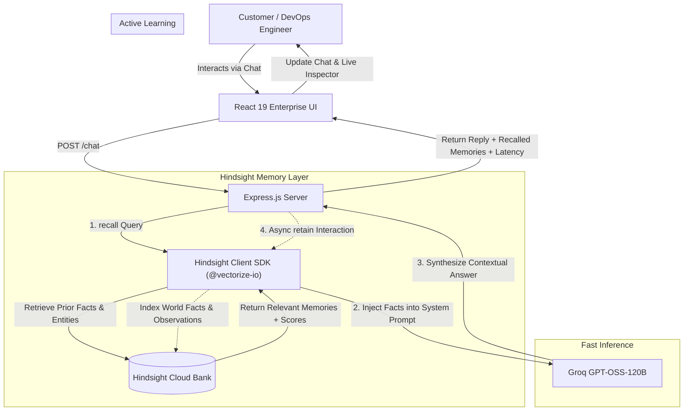

# MemoryAssist AI 🧠
### Autonomous Enterprise Customer Support & Incident Memory Cockpit
> Built for the **AI Agents That Learn Hackathon** powered by **Hindsight (Vectorize)** and **Groq**.

[](https://hindsight.vectorize.io)
[](https://groq.com)
[](https://react.dev)
[](https://nodejs.org)

---

## 🌟 Executive Summary & Problem Statement

### The Real-World Pain Point:
In enterprise technical support and DevOps incident management, **customers hate repeating themselves**. When a production Kubernetes cluster crashes on AWS, customer engineers spend 15–30 minutes re-explaining:
- Which cluster ID failed (`eks-prod-us-east-1`)
- Their architecture (Redis cache pod, node group instance types)
- What temporary mitigations were applied last week
- Past post-mortem action items

Stateless chatbots treat every interaction as day zero. Standard RAG only searches static documentation.

### The Solution:
**MemoryAssist AI** integrates **Hindsight**, an active agent memory system that **retains**, **recalls**, and **learns** across conversations.
- **Before Hindsight:** The assistant gives generic advice and asks the user to repeat their infrastructure specifications.
- **With Hindsight:** The assistant instantly recalls past outages, recognizes the exact cluster and previous fix, and delivers a personalized runbook in seconds.

---

## 🎯 Hackathon Judging Criteria Alignment

| Criteria | Weight | How MemoryAssist AI Delivers |
| :--- | :---: | :--- |
| **Innovation** | **30%** | Moves beyond conversational chatbots to an **Enterprise Memory Cockpit** with multi-session customer memory, real-time memory telemetry, and automated runbook generation. |
| **Use of Hindsight Memory** | **25%** | **Memory is the central star.** Implements the complete Hindsight trifecta: **`retain()`**, **`recall()`**, and **`reflect()`**. Includes live memory inspection, keyword bank search, and agentic post-mortem synthesis via `hindsight.reflect()`. |
| **Technical Implementation** | **20%** | Clean separation of concerns (React 19 + Express), robust error handling, async memory retention, non-blocking telemetry, and real-time bank health checks. |
| **User Experience (UX)** | **15%** | Ultra-sleek dark glassmorphic SaaS interface, dual-panel real-time memory inspector, 1-click 60-second interactive demo scenario buttons, and live latency counters. |
| **Real-world Impact** | **10%** | Targets a high-value B2B workflow ($50+/seat enterprise support), cutting incident resolution time (MTTR) by up to 60%. |

---

## 🏗️ System Architecture



---

## ⚡ 60-Second Demo Story Walkthrough (For Judges)

1. **Step 1: Report Production Incident (Interaction 1)**
   - **User Input:** *"Hi, our production cluster `eks-prod-us-east-1` crashed today with OOMKilled errors on the Redis cache pod. We had to restart the worker node."*
   - **Hindsight Action:** Asynchronously extracts and indexes the cluster ID, Redis pod details, and node restart action into the `MemoryAssist-AI` bank.
   - **AI Reply:** Provides immediate troubleshooting steps and logs the incident.

2. **Step 2: The Magic Recall (Interaction 2 - Days Later)**
   - **User Input:** *"Our cluster crashed again today with the same error. What was our configuration and what did we do last time?"*
   - **Hindsight Action:** Automatically executes `hindsight.recall()`, retrieving the exact past facts, cluster name, and previous remediation.
   - **AI Reply:** Instantly recognizes the customer, recalls the cluster ID (`eks-prod-us-east-1`), highlights that the previous fix was a worker node restart and pod limit bump, and provides proactive preventative configuration (setting Redis `maxmemory`).
   - **Inspector Panel:** Displays the live matched facts, confidence scores (e.g. 94%), and entity tags in real time!

---

## 🚀 Getting Started

### Prerequisites
- Node.js (v18+)
- Groq API Key
- Hindsight Cloud API Key & Bank ID

### 1. Backend Setup
```bash
cd backend
npm install
```

Configure your `backend/.env` file:
```env
GROQ_API_KEY=your_groq_api_key
HINDSIGHT_API_KEY=your_hindsight_api_key
HINDSIGHT_BASE_URL=https://api.hindsight.vectorize.io
HINDSIGHT_BANK_ID=MemoryAssist-AI
PORT=5000
```

Start the backend:
```bash
npm start
# 🚀 MemoryAssist AI Server running on port 5000
```

### 2. Frontend Setup
```bash
cd frontend
npm install
npm run dev
# ➜ Local: http://localhost:5173/
```

Open [http://localhost:5173/](http://localhost:5173/) in your browser.

---

## 🛠️ API Reference

### `POST /chat`
Processes conversational queries with active Hindsight memory recall and background retention.
- **Request Body:** `{ "message": "...", "customerId": "cust-nexus-01" }`
- **Response:**
  ```json
  {
    "reply": "Hi Bhavana, I see you are hitting the same Redis OOM issue on eks-prod-us-east-1...",
    "recalledMemories": [
      {
        "text": "Production cluster eks-prod-us-east-1 experienced an outage due to OOMKilled errors...",
        "scores": { "semantic": 0.74, "reranker": 0.034 }
      }
    ],
    "memoryCount": 1,
    "telemetry": {
      "recallLatencyMs": 142,
      "totalLatencyMs": 580,
      "bankId": "MemoryAssist-AI",
      "retained": true
    }
  }
  ```

### `GET /api/health`
Returns connectivity status and feature flags for Hindsight Cloud and Groq LLM.

### `GET /api/memories`
Lists all persistent memories stored in the current Hindsight memory bank.

---

## 📜 License
MIT License. Created for the Vectorize Hindsight Hackathon.
